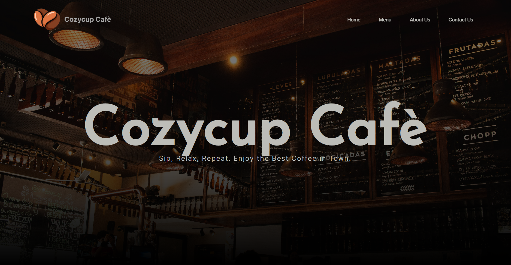
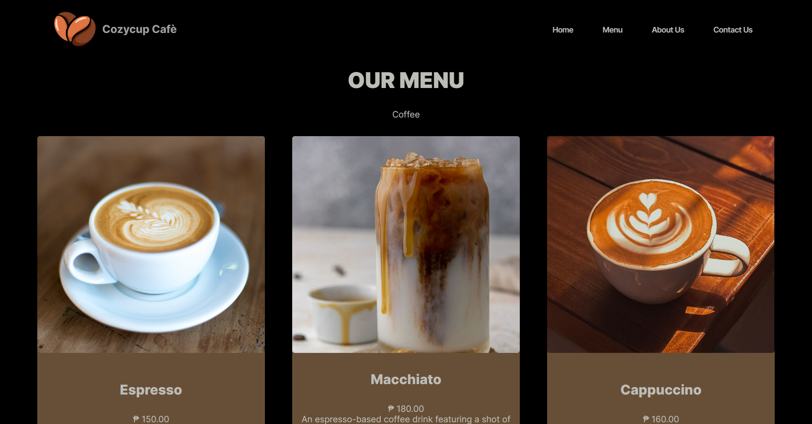
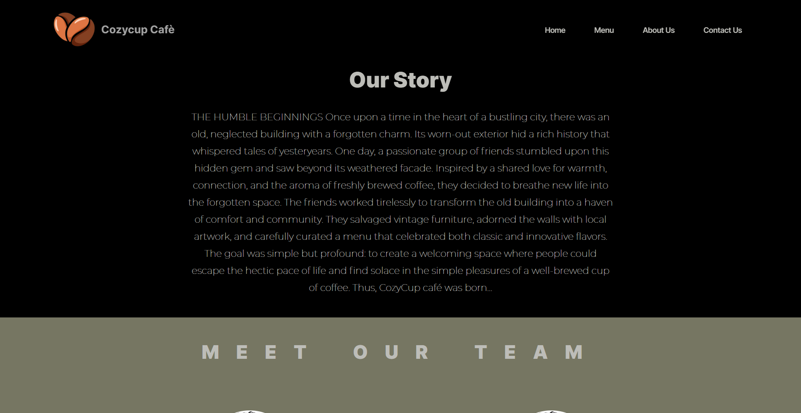
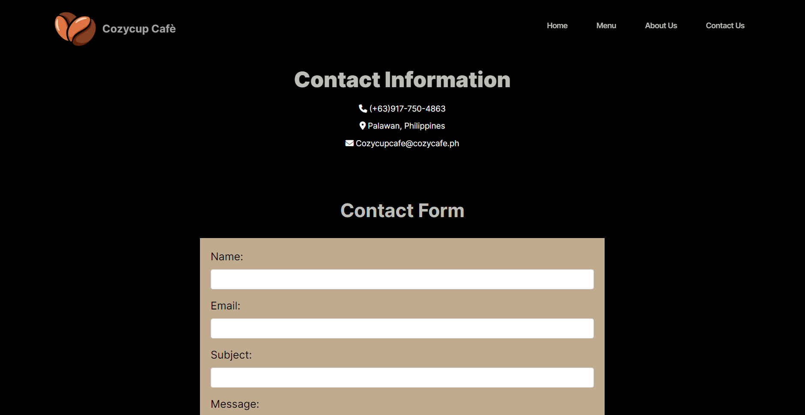

# **Cozy Cup Cafe**

### Project Description

Cozy Cup Cafe is a web application designed to facilitate the management of a small cafe. It provides tools for managing orders, staff, and customer relationships.

### Features

  - **Home:** Welcome to our cafe, featuring a display of popular pastries and beverages.

  - **Menu:** Explore our selection of cafe beverages and pastries, categorized for easy browsing.

  - **About Us:** Learn about our cafe's origins, mission, team, and aspirations.
  
  - **Contact Us:** Get in touch with us through our contact form, or find our location, phone number, and email for inquiries.

### Screen Captures

  

This image showcases the welcoming Home Page of our cafe website, featuring a display of our popular pastries and beverages.

In this image, you can see our Menu section, where customers can explore our diverse selection of cafe beverages and pastries, conveniently categorized for easy browsing.

Here's a glimpse of our About Us page, where visitors can learn about the origins, mission, team, and aspirations of our cafe.

This image displays our Contact Us section, providing visitors with various ways to get in touch with us, including a contact form, our location, phone number, and email for 

## About the Authors

**Name:** Larry John E. Andonga

**Email:** yrraljohnescote@gmail.com

Connect with us:  
 

